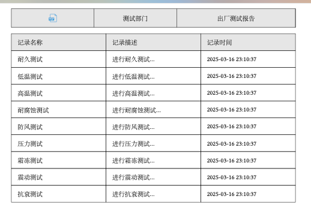
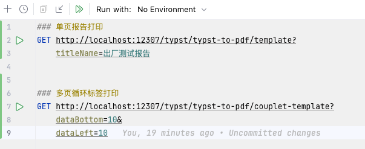
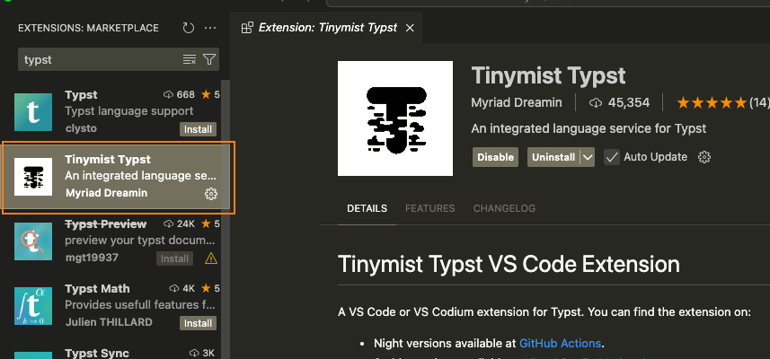

# Typst2pdf-for-report/label/QR code
基于[Typst](https://typst.app/)的PDF生成方案，适用于报告打印/标签打印/二维码打印等。

仅提供后端实现

[](https://github.com/Grant-Vranes/typst2pdf-report-label-QrCode/stargazers)
[](https://github.com/Grant-Vranes/typst2pdf-report-label-QrCode/network)
[](https://github.com/Grant-Vranes/typst2pdf-report-label-QrCode/issues)
[](https://github.com/Grant-Vranes/typst2pdf-report-label-QrCode/blob/main/LICENSE)

## 环境

- JDK11
- linux/windows/mac


## 应用场景

- 适用于定制化的报告模板/标签/条码/二维码等信息的pdf生成方案。
- 通过浏览器的print可直接实现打印功能。


## 效果示例

普通模板打印，对应[模板](./tool/typst_ctl/typst_template/template.typ)

 

多页循环二维码模板打印，对应[模板](./tool/typst_ctl/typst_template/couplet_template.typ)

 


## 测试API用例

使用apifox，提供apifox.json文件 [此处](./http_script/test.http)

  


## Typst介绍

[官网](https://typst.app/)

[github](https://github.com/typst/typst)

[组件市场](https://typst.app/universe)

Typst是一种排版语言（可用于出版与学术写作的可编程[标记语言](https://so.csdn.net/so/search?q=标记语言&spm=1001.2101.3001.7020)），与LaTex和Word类似。

- **编译快速**。Typst使用Rust语言编写

- **体量轻便**。

- **语法简洁**。语法难度低，可自己根据业务轻松修改样式

  

## Typst脚本制作

- 可直接在官网在线编辑调整，但可能不稳定，无法进入
- 可使用vscode安装插件`Tinymist Typst` ,进行本地编辑preview
   


## Typst本地化目录说明

注意，每个版本的typst存在一些语法差异，请根据最新版本，同步最新语法使用。

```
└── tool
    └── typst_ctl
        ├── convert 转换文件夹，程序运行时，需要生成.typ文件用于生成 pdf,此文件夹就用于存放临时的.typ和.pdf文件
        │   ├── logo.svg 因为临时的.typ文件里面引用了这个logo,所以要保持在同一文件夹
        │   ├── tablex 因为临时的.typ文件里面引用了这个包中的组件，避免内网封闭情况下无法从云上拉取，直接就放到本地
        │   ├── tablex-0.0.9 同上
        │   └── tiaoma-0.2.0 同上
        ├── ttf 标准字体，在使用typst compile --font-path 可指定字体，临时的.typ也会引用
        ├── typst-aarch64-apple-darwin macos环境的typst运行文件,可直接于官网https://github.com/typst/typst/releases/tag/v0.10.0下载
        │   ├── 0.10.0
        │   └── 0.13.0
        ├── typst-x86_64-pc-windows-msvc windows环境的typst运行文件
        │   ├── 0.10.0
        │   └── 0.13.0
        ├── typst-x86_64-unknown-linux-musl linux环境的typst运行文件
        │   ├── 0.10.0
        │   └── 0.13.0
        ├── typst-zh_CN-20230409.pdf
        └── typst_template typst的基础模板，程序会替换其中的${},用于填充数据源，最后生成的可执行的临时的.typ放在convert文件夹下
            ├── couplet_template.typ
            └── template.typ
```

